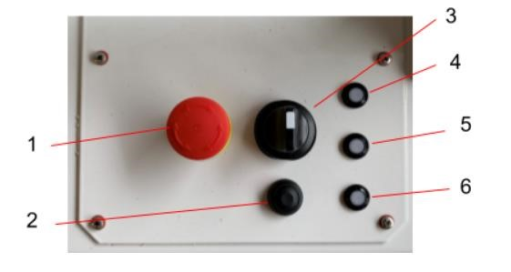
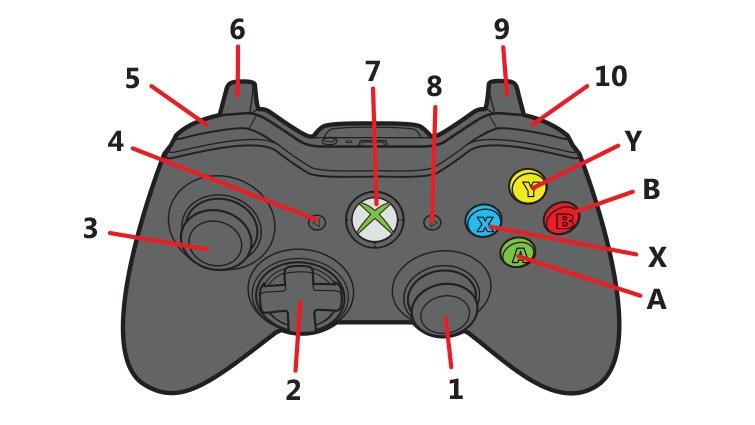

## Thorvald – Quick Start Guide for Driving

## Turning a Thorvalds On.

1. Twist the main power switch (3) 
    - The Robot will emit three audible tones and one of the LEDs (4,5,6) will alight.
2. Press the small button (2) twice in quick succession (<1s between presses)
    - This will boot up the PC into Ubuntu. A second LED with also light up at this point. 
3. Once you have booted into the desktop, run the teleop program by double tapping on the controller icon. Wait for the software to start.
4. Press the small button (2), 4 times in quick succession. 
    - After a short wait (10-15s), the robot will emit an audible clicking then 2 more tones with ascending pitch. This means the motor power is on, the robot should now be drivable. 

## Turning a Thorvalds Off

Truning the robot off is very much the reverse of turning on.

1. Press the small button 4 times to turn the power off to the motors.
2. Shut down the PC as you would any other ubuntu PC.
    - Logout button in top-right corner of the screen.
    - Wait unto the screen reports 'No Signal'
3. Press the small button 2 twice. This turns off the power to the computer.
4. Twist the rotary switch back to its 'off' position.

The Thorvalds is now turned off.
    
## Controlling a Thorvalds with a Controller

  

Referring to the image above; 

- 3 is propulsion forwards and backwards, 
- 1 is steering left and right (propulsion is required to see this). 
- 5 will decrease the maximum speed and 
- 10 will increase it. 
    By default,the speed is 0.75m/s and decrements and increments by 0.1m/s for each button press to a minimum of 0.1m/s and a maximum of 1.5m/s. To return to the default, press 5 and 10 together.

- To switch between moving laterally or longitudinally hold button 8 and press left or up respectively on 2.

- To pivot on the spot, hold Y and press 6 and 9 one after the other, then hold Y and press either 6 or 9 to rotate clockwise or anticlockwise.

## NOTE

It is probably best for you to lower the speed as far as you can for your first drive. Button 1 is the emergency stop. This will turn off power to the motors and stop the robot immediately. There will also be a constant beeping if the estop is pressed to let you know that it is activated.