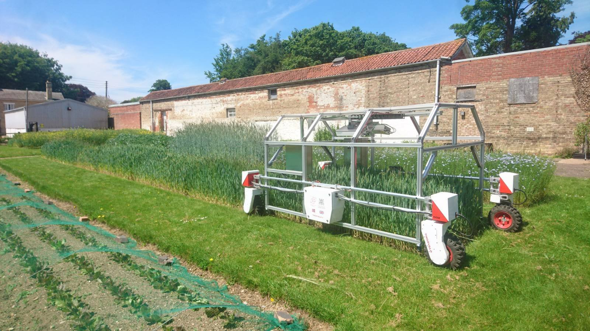

### A Robot in the Long Grass?

We would like to introduce the latest addition to the robot family here at Lincoln. This new platform is designed for in-field robotic phenotyping. Intended to straddle industry standard trial plots (1.5m), the main sensor is a Dual Phenospex [Planteye500](https://phenospex.com/products/plant-phenotyping/planteye-f500-multispectral-3d-laser-scanner/) system. This will allow us to generate multispectral 3D pointcloud data for phenotyping in situations closer to real-world conditions. Moving the robot around has been helped greatly by building the platform on top of the Thorvalds platform from SAGA Robotics. Already nicknamed 'The Beast' by SAGA staff, as far as we can tell, this is the largest system based on thier plaform.Additionally, the platform is soon to be equipped with a number of other sensors that will come online in the coming months;

- RTK GPS - so that we can we can navigate and make repeated measurements of the same crops,
- Multispectral still camera - usually used in drone photography,
- Infrared Camera - At the request of plant scientists, 
- Hyperspectral Still Camera - for when you are very interested in very specific wavelengths of light,
- Realsense RGBD Camera (A ubiquitous device in robotics, being tested for applications in plant science)

The future is already looking busy for the platform. While it's performing initial trials at the moment, trial plots are already growing here in Lincoln so it should be a busy summer for LIAT and Agriforwards Staff and students. If you would like to see the platform for yourselves, it is hoped that we will be exhibiting the System at the 2021 'Cereals' [event](https://www.cerealsevent.co.uk/) later this month. 

Built mainly by Dr. Rob Lloyd, the Agriforwards Senior Mechatronics Engineer during the 2020 - 2021 'Difficult period', this Robot has truly shown that Robotics is a team sport. It couldn't have been completed without the help of others at The University of Lincoln and our partners. Special thanks go to the [AgriforwardsCDT](https://agriforwards-cdt.blogs.lincoln.ac.uk/) team, colleagues in [LCAS](https://lcas.lincoln.ac.uk/wp/) and [LIAT](https://www.lincoln.ac.uk/home/liat/) and [SAGA Robotics](https://sagarobotics.com/).

